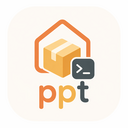

# ppt

Personal Package Tool

`ppt` installs CLI tools from Git repository releases into your home directory on
Linux without root.

It is meant for systems where you want a modern personal toolbox such as `bat`,
`nvim`, `btop`, `rg`, and `fd`, but do not want to depend on the system package
manager.

`ppt` is especially aimed at:
- shared Linux servers
- locked-down enterprise hosts
- ephemeral VMs and containers
- mixed distros such as Ubuntu, Debian, Fedora, and RHEL
- mixed architectures such as `x86_64` and `arm64`

`ppt` is binary-first:
- you give it a full Git repository URL
- it inspects the project's releases
- it selects a Linux asset that matches the current system
- it installs that release into a user-owned prefix
- it exposes the installed commands through a personal `bin` directory

If a project does not publish usable Linux release binaries, it is out of scope
for the first version.

`ppt` is also intended to work well with version-controlled dotfiles. You should
be able to keep `ppt` config in `yadm` or another dotfile manager and share it
across different Linux systems.

## Install

```bash
curl -fsSL https://gitlab.com/perapp/ppt/-/releases/permalink/latest/downloads/install.sh | bash
```

If needed, add `ppt` to your `PATH`:

```bash
export PATH="$HOME/.local/ppt/bin:$PATH"
```

To automatically keep `PATH` and shell completion up to date, add this to your shell init file (for example `~/.bashrc`):

```bash
eval "$(\"$HOME/.local/ppt/bin/ppt\" shell-env --shell bash)"
```

Alternatively, let `ppt` update your shell config for you:

```bash
ppt update-shell-config
```

## Usage

```text
# add a package to the managed set and install it
ppt add <repo-url> [--constraint <tag>] [--prefix <prefix>]

# remove a package
ppt remove <repo-url|short-id>

# change the command prefix used for an installed package
ppt prefix <repo-url|short-id> <prefix>

# make this machine match the shared config and lock file
ppt sync

# fetch the latest/available versions for configured packages
ppt update [repo-url|short-id]

# bump locked versions for unconstrained packages and install them locally
ppt upgrade [repo-url|short-id]

# list installed packages
ppt list

# list all configured packages
ppt list --all

# list packages that would be upgraded by `ppt upgrade`
ppt list --upgradable

# show details for one package
ppt info <repo-url|short-id>
```

## Config Files

`ppt` keeps its shared configuration in `~/.config/ppt/`.

```text
~/.config/ppt/
  packages.toml
```

- `packages.toml` is the desired package set and the locked versions.

Terminology:
- **Constraint**: what you want (currently only an exact version tag; future: ranges)
- **Locked**: the resolved version this config will install on machines
- **Installed**: what is currently installed on this machine
- **Available**: the latest version matching the constraint (populated by `ppt update`)

By keeping this file version controlled, using for example a dot manager like yadm,
you can share the same `ppt` config and state between machines, VMs and containers
while still keeping upgrades explicit.

## Examples

```bash
# install ~/.local/ppt/bin/nvim
ppt add https://github.com/neovim/neovim

# install your own fork as ~/.local/ppt/bin/my-nvim
ppt add https://github.com/myself/neovim --prefix my-

# install a specific version as ~/.local/ppt/bin/nvim-0.12.1
ppt add https://github.com/neovim/neovim --constraint v0.12.1

# change prefixes so your fork becomes nvim and upstream becomes src-nvim
ppt prefix https://github.com/neovim/neovim src-
ppt prefix https://github.com/myself/neovim ""

# check if config or locked versions are outdated on this machine
# usefull in a dotmanager pull hook or `.bash_profile`.
ppt sync --check
ppt sync

# explicitly bump unconstrained packages to newer releases
ppt upgrade
```

## Command Model

`ppt add` records a package in config and installs it immediately when possible.

`ppt sync` makes the current machine match `packages.toml`. This is the command to run
after pulling updated dotfiles onto another machine.

`ppt sync --check` performs a local-only drift check, prints nothing when the
system is already in sync, and exits with `10` when a sync is needed. In the
out-of-sync case it prints a short message telling you to run `ppt sync`. This
is intended for shell startup hooks or prompt scripts.

`ppt update` fetches the latest release info for your configured packages and stores
it locally so commands like `ppt info` and `ppt list --upgradable` can show what is
available without doing network calls every time.

`ppt upgrade` updates the locked versions for packages without an explicit constraint
and installs those new versions on the current machine. This keeps upgrades explicit, which
is useful when tool config or plugins may break across releases.

If a package is configured but has no matching release artifact for the current
platform, `ppt` should warn and continue. `ppt list` should still show that
package as unavailable on this machine.

## Notes

`ppt` is intended to complement, not replace, the system package manager. Use
the system package manager for operating system packages, shared libraries, and
services. Use `ppt` for personal CLI tools installed in your home directory.

## Contributing

For information how to contribute or fork this project, see [CONTRIBUTING.md](CONTRIBUTING.md).
